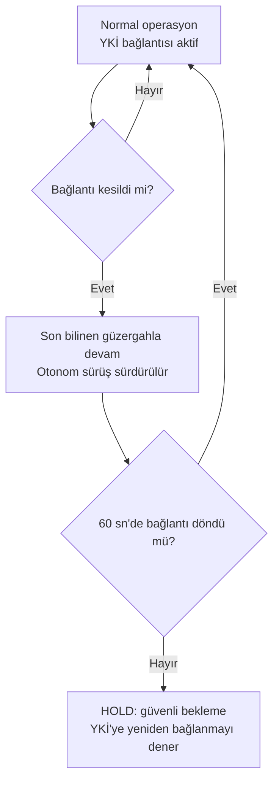

# İKA Bağlantı Kaybı (İKA↔YKİ) Davranış Mantığı (DDR Bölüm 3.3.1)

İlişkili: ÖDR Bölüm 6.5 (Bağlantı Kaybı Failsafe Stratejisi), Req 19 (tam otonomi)

## Notlar
- ÖDR Bölüm 6.5'teki "İKA hold + 60 sn timeout" satırının somut yazılım mantığıdır.
- Bağlantı kesikken bile İKA **tam otonom** çalışmaya devam eder (Req 19) — son alınan güzergah verisiyle DWA/Nav2 planlaması sürer, YKİ'den yeni komut beklenmez.
- 60 saniye timeout aşılırsa İKA güvenli bekleme (HOLD) durumuna geçer; bu noktadan sonrasının (manuel müdahale mi, görev iptali mi) hakem/şartname kurallarına göre netleştirilmesi gerekiyor — bu konuyu toplantıda gündeme alalım.
