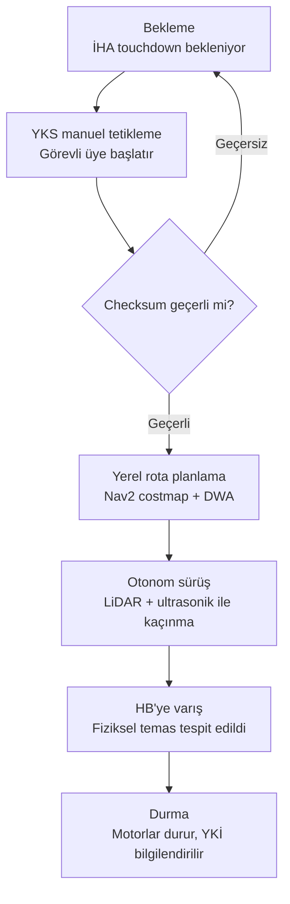

# İKA Görev Akış Şeması (DDR Bölüm 3.3.1)

İlişkili gereksinimler: Req 15, 16, 17, 18, 19, 24, 32-34

## Notlar
- **Checksum kontrolü**: route_update mesajı (bkz. `docs/icd/guzergah_paket_formati_v1.md`) bozuk gelirse İKA pakete güvenmez, bekleme durumuna geri döner. Bu, Req 16/17'nin güvenilir şekilde karşılanmasını sağlar.
- **İnterlock**: "Bekleme" durumunda İKA motorları donanımsal olarak pasif tutulur; İHA'nın touchdown sinyali gelmeden bu duruma girilemez (Req 32-34, ÖDR Bölüm 5.6).
- **Tam otonomi**: "YKS manuel tetikleme" adımından sonraki TÜM adımlar (checksum kontrolü, rota planlama, sürüş, varış tespiti) otonom çalışır — yalnızca başlatma manuel (Req 19).
