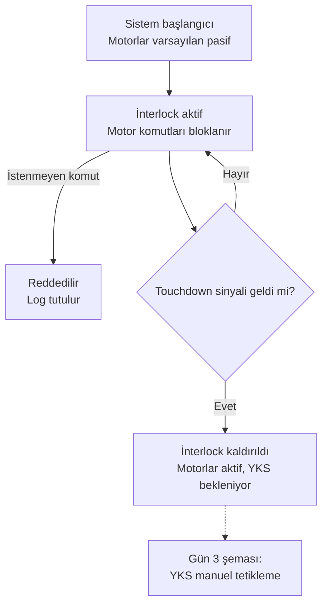

# İKA İnterlock Mantık Akışı (DDR Bölüm 3.3.1)

İlişkili gereksinimler: Req 32, 33, 34 — Şartname 2.2.5 ("İHA yere temas etmeden İKA hareket edemez")

## Notlar
- **Varsayılan güvenli durum (fail-safe default):** Sistem her açıldığında motorlar pasif başlar; interlock'un kaldırılması için AKTİF bir onay (touchdown sinyali) gerekir, "onay yoksa serbest" mantığı değil "onay varsa serbest" mantığı kullanılır.
- **İstenmeyen komut reddi:** İnterlock aktifken herhangi bir motor komutu (yazılım hatası, gecikmeli mesaj, vb.) gelirse bu komut çalıştırılmaz ve reddedilme nedeni loglanır — bu log, DDR Bölüm 4 (Test Faaliyetleri) kanıtı olarak kullanılabilir.
- Bu şema, `ika_safety` paketinde bir ROS 2 lifecycle/state node olarak kodlanacaktır (Gün 11).
