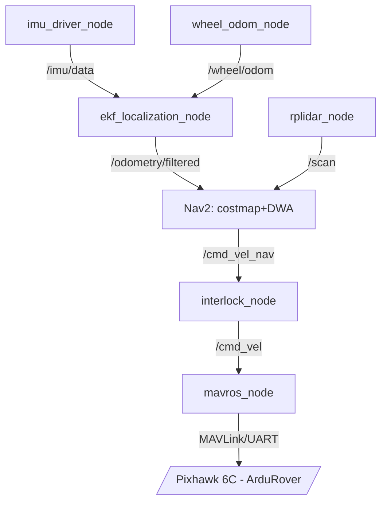

# İKA ROS 2 Node Mimarisi (DDR Bölüm 3.3.1 / 3.3.5)

## Node Grafiği (ana kontrol döngüsü)

## Tam Node Tablosu

| Node adı | Paket | Görev | Abone olunan | Yayınlanan |
|---|---|---|---|---|
| rplidar_node | (harici) | LiDAR ham veri | - | /scan |
| imu_driver_node | ika_localization | IMU ham veri | - | /imu/data |
| wheel_odom_node | ika_localization | Enkoder odometri | /motor/encoder_ticks | /wheel/odom |
| ekf_localization_node | ika_localization | Sensör füzyonu | /imu/data, /wheel/odom | /odometry/filtered |
| Nav2 yığını | ika_navigation | Costmap+DWA | /scan, /odometry/filtered, /route/waypoints | /cmd_vel_nav |
| interlock_node | ika_safety | Touchdown kapısı (Gün4) | /cmd_vel_nav, /mission/state | /cmd_vel |
| mavros_node | ika_bringup | Pixhawk köprüsü | /cmd_vel | /mavros/local_position/odom |
| route_bridge_node | ika_comms | UDP↔ROS2 köprüsü (Gün1 ICD) | UDP soket | /route/waypoints, UDP route_ack |
| mission_manager_node | ika_bringup | Görev akışı (Gün3) | /route/waypoints, /iha/touchdown_status | /mission/state |
